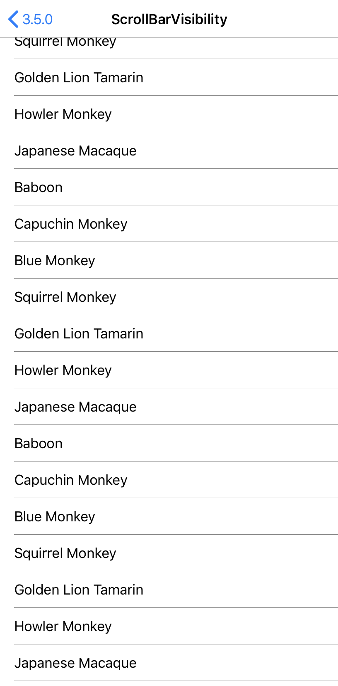
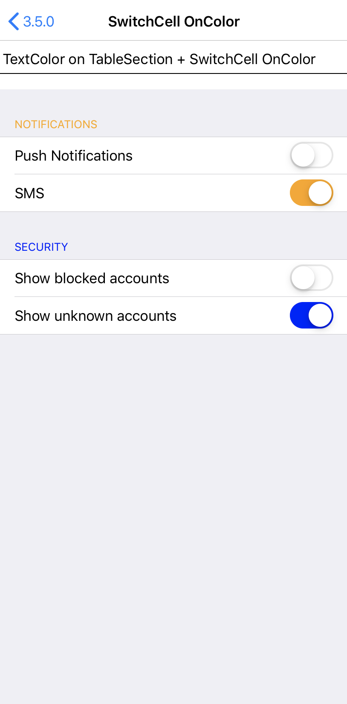

# ThreeFivePlayground

**Xamarin.Forms** sample to show the main features of **3.5** version.

The sample is available for two platforms:

- iOS
- Android

Features:
- Bindable Layout
- ListView ScrollBarVisibility
- SwitchCell OnColor

## Screenshots

  

## Copyright and license

Code released under the [MIT license](https://opensource.org/licenses/MIT).